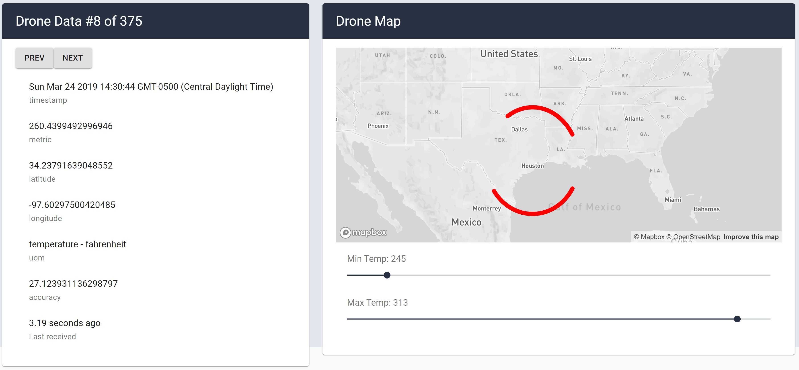

## Create React App Visualization

Deployed on the Google Cloud App Engine: [https://kazanski-eog-react-assessment.appspot.com](https://kazanski-eog-react-assessment.appspot.com/)

### Installation

1. Git clone this repo: https://github.com/markkazanski/mark-kazanski-eog-react-assessment/
2. ```cd mark-kazanski-eog-react-assessment```
3. Mapbox GL API KEY Required, 2 options:
   * In root directory create file ```.env.local``` with content ```REACT_APP_MAPBOX_TOKEN=<Mapbox GL API KEY>```
   * If API KEY is not available: in the file [src/components/Map.js](
        src/components/Map.js
      ) uncomment **Line 11**
      
4. Run command ```yarn install```. 
5. Run command ```yarn start```
6. Open URL in a browser: http://localhost:3000/

### Description

There are 2 visualization items in the dashboard: drone data display and a map visualization.



#### Drone Data Display

This displays drone data as text and the time since last update. The data is shows for 1 drone at a time and the user can use "Next" and "Prev" buttons to advance through all 375 drones. The API is polled every 4 seconds.

#### Map Visualization

This uses the Mapbox GL package to display all drones. The map updates as the API is polled, every 4 seconds. 

The controls below the map filter drones by temperature. The "Min Temp" slider adjust the minimum temperature that will be displayed on the map. The "Max Temp" adjust the maximum temperature. The sliders will not cross over, i.e. the minimum will never be higher than the maximum.

### Room for Improvement

1. As the drone data loads there the cards are empty and this causes the grids to wobble. This can be fixed by using fixed width columns or using a flexbox layout. 

2. The map should will the width of the card it is in. This can be accomplished by making the viewport width dynamic, probably by using ```getBoundingClientRect()```. 

3. The drone data display can use a more features: 
  a. switching temperature from Kelvin to Celcius to Farenheit
  b. sorting by temperature or by relevance
  c. adding statistical information, standard deviation, etc. 
  
4. Map visualization can use more features, too:
  a. adding different layers, like heatmap 
  b. letting user switch between layers
  
5. Storing data over a period of time and showing changes in temperature over time.

6. Removing the hardcoded API key for Mapbox GL. The API KEY is stored in an environmental variable. However, for ease of testing I kept the hardcoded API KEY but commented it out. That way the person evaluating this project has the options of simply uncommenting that line.
